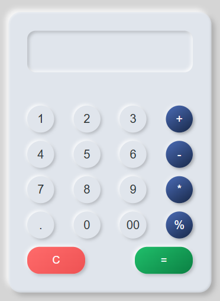

📚 Calculator
A sleek and responsive calculator web application built with HTML, CSS, and JavaScript.

  
  

🔍 About
The Calculator is a simple yet elegant tool that provides users with a seamless and intuitive experience for performing basic arithmetic operations. With its clean and modern design, the application blends form and function to create a visually appealing and user-friendly interface.

## 🎯 Demo
Try out the game here: [Live Demo](https://shahilmd.github.io/Calculator-Project/)

🛠️ Features

Supports basic arithmetic operations: addition, subtraction, multiplication, and division
Responsive design that adapts to both desktop and mobile devices
Smooth animations and hover effects for an interactive user experience
Clear input field functionality to start a new calculation
Ability to perform consecutive calculations

🚀 Usage

Open the index.html file in a web browser.
Use the on-screen buttons to input numbers and perform calculations.
The results will be displayed in the input field.
Click the "C" button to clear the input field and start a new calculation.
Click the "=" button to evaluate the expression and display the result.

🛠️ Technologies Used

HTML: Provides the structure and content of the calculator.
CSS: Styles the calculator's interface, including the layout, colors, and animations.
JavaScript: Handles the calculator's functionality, such as processing user input and updating the display.

🤝 Contributing
Contributions are welcome! If you find any issues or have suggestions for improvements, please feel free to submit a pull request or create a new issue.
